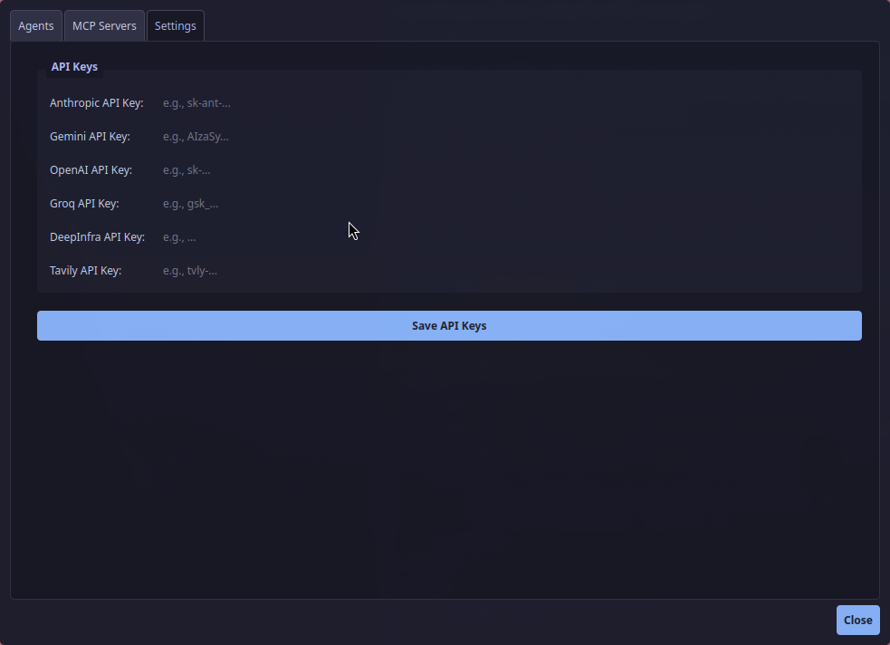
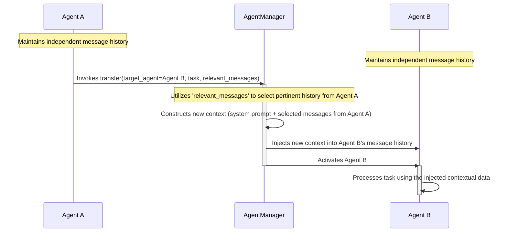

<p align="center">
  <a href="https://github.com/daltonnyx/AgentCrew">
    
  </a>
</p>
<h1 align="center">AgentCrew: Your Multi-Agent AI Assistant Framework</h1>

[](https://github.com/saigontechnology/AgentCrew/stargazers)
[](https://github.com/saigontechnology/AgentCrew/blob/main/LICENSE)
[](https://github.com/saigontechnology/AgentCrew/releases)
[](https://www.python.org/downloads/release/python-3120/)

AgentCrew is a powerful and flexible AI assistant framework, engineered for
sophisticated AI interaction that transcends rudimentary chatbot
functionalities. It establishes an ecosystem where specialized AI agents operate
in a coordinated fashion, governed by a system designed for contextual task
routing and supporting a diverse array of Large Language Model (LLM) providers.

The conceptual model is that of a distributed expertise network, where
individual agents contribute specialized capabilities to a unified
conversational process, whether through a rich console interface or a
user-friendly GUI.

## Visualizing AgentCrew Operations

- **Central Interaction Interface:** The primary console for AI-driven
  dialogues. 
- **Code Articulation & Generation:** Demonstrating native support for
  code-centric tasks.
  
- **Multimedia Context:** Integration of image files within conversational
  flows. 
- **Agent Specialization:** Configuration interface for defining agent roles and
  capabilities. 
- **External Protocol Integration:** Configuration for Model Context Protocol
  (MCP) servers. 
- **System-Wide Configuration:** Interface for global operational parameters.
  

### Multi-Agents in Action

<https://github.com/user-attachments/assets/43b84b63-027e-4615-8bd1-96211dc9b28e>

## Core Tenets of the AgentCrew Design

AgentCrew was conceptualized not merely as an LLM interface layer, but as a
system predicated on the principles of **synergy through specialization**. The
limitations of monolithic, generalist AI models are addressed by a distributed
architecture of specialized agents.

### 1. The Multi-Agent Architecture: Distributed Expertise

Complex problem-solving typically involves a multifaceted team; AgentCrew
mirrors this by design. The `agents.toml` configuration file serves as the
manifest for this distributed expertise:

```toml
[[agents]]
name = "Coding"
description = "Specialized in code implementation, debugging, programming assistance and aider prompt"
tools = ["clipboard", "memory", "code_analysis", "spec_validator"]
system_prompt = """You are Harvey, a focused code implementation expert. Your guiding principle: **SIMPLICITY IN IMPLEMENTATION** (Simple + Practical Implementation). Prioritize clean, maintainable code that aligns with best practices.

Today is {current_date}.
"""
```

The inclusion of dynamic templating, such as `{current_date}`, allows for
enhanced contextual awareness. This architectural choice facilitates:

- **Domain-Optimized Performance:** Agents demonstrate superior efficacy in
  their designated areas of expertise.
- **Contextual Coherence:** Task transitions across domains maintain underlying
  conversational context.
- **Emergent Problem-Solving Capabilities:** The architecture supports complex
  interactions between agents.

The operational pipeline is defined as:
`[User Input] --> [Agent Manager] --> [Selected Agent] --> [LLM Service] --> [Response]`.

### 2. Intelligent Agent Orchestration: Contextual Task Transfer

System efficacy relies heavily on robust coordination. The **intelligent
transfer system** is central to this, managing the delegation of tasks between
agents based on evolving conversational context:

1. The active agent assesses its suitability for the current conversational
   turn.
2. If a different specialization is required, a transfer is initiated using the
   `transfer` tool.
3. The `AgentManager` constructs a new operational context, utilizing relevant
   message history segments from the transferring agent.
4. The designated target agent is activated with this tailored context.

This process is depicted as follows:



This mechanism is integral to the system's adaptability and advanced interactive
capabilities.

### 3. LLM Provider Abstraction: Agnostic Model Integration

Given the dynamic nature of the LLM landscape, AgentCrew incorporates a unified
service layer to abstract provider-specific implementations. This design
ensures:

- Flexibility in selecting LLM providers (Claude, GPT, Groq, Gemini, DeepInfra,
  Custom OpenAI-compatible).
- Utilization of provider-specific functionalities (e.g., Claude's extended
  thinking, OpenAI's function calling) without requiring modifications to the
  core application logic.
- Enhanced system maintainability and adaptability to future LLM advancements.

## Features

- **Multi-LLM Provider Support:**
  - Anthropic (Claude 3.x series)
  - Google (Gemini 2.x series)
  - OpenAI (GPT-4o, GPT-4.1, o3/o4 series with "thinking" mode)
  - Groq (Llama 3.x/4.x, Qwen, Deepseek, including compound models with
    "thinking")
  - DeepInfra (Llama 3.x, Gemma 3, Phi-4, Qwen 2.x/3.x)
  - Custom OpenAI-compatible LLM providers via configuration.
- **Advanced Agent Framework:**
  - Define and manage multiple specialized local AI agents.
  - Support for remote agents via Agent-to-Agent (A2A) protocol.
  - Dynamic agent selection and contextual task transfer using the `transfer`
    tool.
  - Customizable system prompts per agent, including dynamic variables like
    `{current_date}`.
- **Rich Tool Integration:**
  - **Web Search:** Tavily API for up-to-date information and web content
    extraction.
  - **Clipboard Interaction:** Read from and write to the system clipboard.
  - **Memory System:**
    - ChromaDB for persistent conversation memory and semantic retrieval.
    - Context persistence service for saving/loading full conversation states,
      enabling session resumption.
    - Tools to `retrieve_memory` and `forget_memory_topic`.
  - **Code Analysis:** Tree-sitter based `analyze_repo` for code structure
    mapping and `read_file` for specific code element retrieval.
  - **Coding Assistance (Aider Integration):**
    - `review_specification_prompt` tool to validate prompts for coding tasks.
    - `implement_specification_prompt` tool to generate code using Aider based
      on validated specs.
  - **Model Context Protocol (MCP) Client:** Connect to and utilize tools from
    MCP-compliant servers (e.g., for running external processes).
- **Dual Chat Interfaces:**
  - **Console UI:** Rich text, command history, completions, and dynamic updates
    for terminal users.
  - **Graphical User Interface (GUI):** Built with PySide6 (Qt), offering a
    user-friendly chat window, conversation history sidebar, and comprehensive
    configuration dialogues.
- **Agent-to-Agent (A2A) Communication:**
  - Run an A2A server to expose your AgentCrew agents to other A2A-compliant
    systems.
  - Define remote agents in your configuration to interact with external A2A
    agents.
- **Streaming and Thinking Mode:**
  - Supports streaming responses from LLMs for real-time interaction.
  - "Thinking mode" support for compatible models (Claude, Gemini, Groq
    compound, OpenAI o-series), allowing the LLM to show its reasoning process.
- **Configuration Management:**
  - Easy configuration via TOML and JSON files.
  - Environment variables for sensitive data like API keys.
  - GUI for managing API keys, agent definitions, MCP servers, and custom LLM
    providers.
- **Persistent Conversations:**
  - Save and load entire conversation histories, including messages from all
    participating agents.
  - Sidebar in GUI for easy browsing, searching, and loading of past
    conversations.
  - Rollback functionality in GUI to rewind conversation state.
- **File Handling:**
  - Integrates with `docling` for processing PDF, DOCX, XLSX, PPTX.
  - Supports direct inclusion of text and image files in chat.
- **Keyboard Navigation & Shortcuts:** Efficient interaction with `Ctrl+Enter`
  for send, `Ctrl+Shift+C` for copy, `Ctrl+L` for new chat, and history
  navigation in console.

## Prerequisites

- Python 3.12+
- `uv` Python package manager (Install with `pip install uv` or see
  [official `uv` documentation](https://github.com/astral-sh/uv))
- Git (required for the code analysis tool to list repository files)
- API keys for the LLM providers and services you intend to use (e.g., OpenAI,
  Anthropic, Tavily). At least one LLM provider API key is required.

## Installation (one-line script)

### Linux and MacOS

```bash
curl -LsSf https://gist.githubusercontent.com/daltonnyx/aa45d64fd8fb6a084067d4012a5710a6/raw/9a75abc1811c0e2805352fd7d97e2326964d2403/install.sh | bash
```

### Windows

```powershell
powershell -ExecutionPolicy ByPass -c "irm https://gist.githubusercontent.com/daltonnyx/e2d9a4d371e095bfa07cf5246d7e0746/raw/af138f99ed5351dc59cae81143e058ef95b5fa37/install.ps1 | iex"
```

> Notes: I have not tested Windows script yet since I don't have any Windows
> machine, please open a ticket if you have trouble with it.

## Installation (using `uv`)

1. **Clone the repository:**

   ```bash
   git clone https://github.com/daltonnyx/AgentCrew.git
   cd AgentCrew
   ```

2. **Create and activate a virtual environment using `uv`:**

   ```bash
   uv venv
   source .venv/bin/activate  # On Linux/macOS
   # .\.venv\Scripts\activate  # On Windows (Command Prompt)
   # .\.venv\Scripts\Activate.ps1 # On Windows (PowerShell)
   ```

3. **Install AgentCrew and its dependencies:**

   ```bash
   uv pip install .
   ```

   For development, including tools like `pyinstaller` and `pygments`:

   ```bash
   uv pip install .[dev]
   ```

   If you want to use the Mem0 memory service (optional alternative to
   ChromaDB):

   ```bash
   uv pip install .[mem0ai]
   ```

4. **Install as a tool (optional, for global access):** This makes the
   `agentcrew` command available system-wide if your `uv` tools directory is in
   your PATH.

   ```bash
   uv tool install .
   ```

## Configuration

AgentCrew uses a combination of environment variables and configuration files,
primarily stored in `~/.AgentCrew/`.

### API Keys & Global Settings (`~/.AgentCrew/config.json`)

API keys are essential. You can set them as environment variables OR manage them
through the global `config.json` file using the GUI (Settings -> Global
Settings).

1. **Environment Variables (Recommended for security in non-GUI setups):** Set
   these in your shell environment or a `.env` file in the project root
   (AgentCrew will load it).

   ```bash
   export ANTHROPIC_API_KEY="your_anthropic_key"
   export GEMINI_API_KEY="your_gemini_key"
   export OPENAI_API_KEY="your_openai_key"
   export GROQ_API_KEY="your_groq_key"
   export DEEPINFRA_API_KEY="your_deepinfra_key"
   export TAVILY_API_KEY="your_tavily_key" # Required for web search tool
   export VOYAGE_API_KEY="your_voyage_key" # Optional, for VoyageAI embeddings with ChromaDB
   ```

   **Note:** Keys set in `config.json` via the GUI will take precedence over
   environment variables.

2. **Global `config.json` File:**

   - **Path:** `~/.AgentCrew/config.json`. Can be overridden by
     `AGENTCREW_CONFIG_PATH`.
   - **Purpose:** Stores API keys and configurations for custom LLM providers.
   - **Management:** Best managed via the GUI (Settings -> Global Settings &
     Settings -> Custom LLMs).
   - **Structure Example:**

     ```json
     {
       "api_keys": {
         "ANTHROPIC_API_KEY": "your_anthropic_key_from_gui",
         "TAVILY_API_KEY": "your_tavily_key_from_gui"
       },
       "custom_llm_providers": [
         {
           "name": "MyLocalLLM",
           "type": "openai_compatible",
           "api_base_url": "http://localhost:1234/v1",
           "api_key": "optional_local_key_if_needed",
           "default_model_id": "local-model-v1",
           "is_stream": true,
           "available_models": [
             {
               "id": "local-model-v1",
               "provider": "MyLocalLLM", // Should match the "name" above
               "name": "Local Model Version 1",
               "description": "My custom fine-tuned model.",
               "capabilities": ["tool_use"], // e.g., "tool_use", "vision", "thinking"
               "input_token_price_1m": 0.0, // Price per 1 million input tokens
               "output_token_price_1m": 0.0 // Price per 1 million output tokens
             }
           ]
         }
       ]
     }
     ```

### Agent Configuration (`~/.AgentCrew/agents.toml`)

- **Path:** `~/.AgentCrew/agents.toml`. Can be overridden by `SW_AGENTS_CONFIG`
  or `--agent-config` CLI flag. A default is created if not found.
- **Purpose:** Defines local and remote agents, system prompts, tools, and
  temperature.
- **Management:** Can be managed via the GUI (Settings -> Agents).
- **Structure Example:** See `examples/agents/agents.toml` or
  `examples/agents/agents.simple.toml`.

### MCP Server Configuration (`~/.AgentCrew/mcp_servers.json`)

- **Path:** `~/.AgentCrew/mcp_server.json`. Can be overridden by
  `MCP_CONFIG_PATH` or `--mcp-config` CLI flag.
- **Purpose:** Configures external Model Context Protocol (MCP) servers.
- **Management:** Can be managed via the GUI (Settings -> MCP Servers).
- **Structure Example:** See `mcp_servers.json.example`.

**Other Default Paths:**

- `MEMORYDB_PATH`: `~/.AgentCrew/memorydb` (ChromaDB persistence).
- `PERSISTENCE_DIR`: `~/.AgentCrew/persistents` (Conversation history, user
  context).
- `.chat_histories`: `~/.AgentCrew/.chat_histories` (Console command history).

## Usage

### Interactive Chat (GUI/Console)

The primary way to interact with AgentCrew is through its chat interface.

**1. Using the CLI:** The main command is `agentcrew` (if installed as a tool)
or `python -m AgentCrew.main` (if running from the cloned repo with `uv sync`).

```bash
agentcrew chat [OPTIONS]
```

**Options:** _`--provider [claude|groq|openai|google|deepinfra]`: Specify LLM
provider. Auto-detects if not set._ `--agent-config PATH`: Path to a custom
agent configuration file. _`--mcp-config PATH`: Path to a custom MCP server
configuration file._ `--console`: Use the console UI instead of the default GUI.

**Examples:** _Start GUI chat (auto-detects provider): `agentcrew chat`_ Start
console chat with OpenAI: `agentcrew chat --provider openai --console`

**2. Running the GUI Directly (for development):**

```bash
python AgentCrew/entry.qt.py
```

(Ensure virtual environment is active and configs/API keys are set up.)

**In-Chat Commands (Console & GUI where applicable):**

- `/clear` or `Ctrl+L` (GUI): Clears current conversation, starts a new one.
- `/copy` or `Ctrl+Shift+C` (GUI): Copies the last assistant's response.
- `/file <path/to/file>`: Includes file content in your message.
- `/model [model_id]`: Lists models or switches model (GUI: Menu -> Models).
- `/agent [agent_name]`: Lists agents or switches agent (GUI: Menu -> Agents).
- `/jump <turn_number>` (Console): Rewinds conversation to a previous turn.
  (GUI: Rollback button on user messages).
- `/think <budget_or_level>`: Configures "thinking mode" for compatible LLMs
  (e.g., `/think 1024` for Claude, `/think medium` for OpenAI o-series).
  `/think 0` or `/think none` disables it.
- `/list`: Lists saved conversations (GUI: Sidebar).
- `/load <id_or_number>`: Loads a saved conversation (GUI: Click on conversation
  in sidebar).
- `/debug`: Displays raw message history for debugging.
- `exit` or `quit`: Exits the chat.

### A2A Server

Expose your AgentCrew agents via the A2A protocol:

```bash
agentcrew a2a_server [OPTIONS]
```

**Options:**

- `--host TEXT`: Host to bind (default: `0.0.0.0`).
- `--port INTEGER`: Port to bind (default: `41241`).
- `--base-url TEXT`: Base URL for agent endpoints.
- `--provider ...`: LLM provider for served agents.
- `--agent-config PATH`, `--mcp-config PATH`: Custom config paths.

## Key Concepts

### Agents

Specialized AI instances, each with:

- A unique `name` and `description`.
- A `system_prompt` defining its persona and instructions (supports
  `{current_date}`).
- A list of assigned `tools`.
- An optional `temperature` for its LLM.
- Local agents use configured LLM services; remote agents connect to external
  A2A endpoints.

### Tools

Extend agent capabilities. AgentCrew includes:

- `memory`: For long-term conversation recall (retrieve/forget).
- `clipboard`: Read/write system clipboard.
- `web_search`: Tavily-powered web search and content extraction.
- `code_analysis`: Tree-sitter based code structure analysis (`analyze_repo`)
  and file/element content retrieval (`read_file`).
- `aider`: Spec prompt validation (`review_specification_prompt`) and
  Aider-integrated code generation (`implement_specification_prompt`).
- `mcpclient_*`: Tools for MCP server interaction (connect, list, call,
  disconnect), dynamically registered based on `mcp_servers.json`.
- `transfer`: Enables an agent to delegate the current task and context to
  another agent.

### LLM Providers & Thinking Mode

AgentCrew abstracts LLM interactions, supporting multiple providers. "Thinking
Mode" allows compatible LLMs (Claude, some OpenAI/Groq/Gemini models) to
articulate their reasoning process. This can be configured via the `/think`
command or model capabilities. For Claude, it uses a token budget; for OpenAI
o-series, it uses "low", "medium", "high" effort levels.

## Development & Customization

- **Adding New Tools:** Create a module in `AgentCrew/modules/your_tool/` with
  `service.py` and `tool.py`. Implement `get_your_tool_definition()`,
  `get_your_tool_handler()`, and `register()` functions. Integrate into
  `main.py` and `entry.qt.py`.
- **Adding New LLM Providers:**
  - **OpenAI-Compatible:** Add to `config.json` under `custom_llm_providers` or
    via GUI.
  - **New SDKs:** Create a service class inheriting `BaseLLMService`, integrate
    into `ServiceManager` and `ModelRegistry`.
- **Customizing Agents:** Modify `agents.toml` or use the GUI.

## Security and Responsible Usage Advisory

AgentCrew provides extensive control over AI agents and external tool
integrations. **Users bear sole responsibility for:**

- The content and implications of agent system prompts.
- The selection and enablement of external tools (MCP, file access, clipboard).
- Potential consequences arising from insecure prompts or tool configurations,
  including data leakage, data loss, or unintended system actions.

It is imperative to thoroughly review all prompts and tool settings prior to
operational use. Employ default safe configurations unless the risks associated
with advanced settings are fully understood. For optimal security:

- Adhere to the principle of least privilege for tool permissions.
- Never embed sensitive credentials (passwords, API keys) directly within
  prompts or configuration files.
- Exercise extreme caution and require explicit confirmation before enabling
  tools with broad filesystem or network access capabilities.

AgentCrew is a powerful system; its responsible operation is paramount.

## Development Roadmap

Planned enhancements and future development directions:

### Enhanced Assistant Capabilities

- [x] Web Search Integration
- [x] Conversation Memory (ChromaDB, Session Persistence)
- [x] Code Analysis (Tree-sitter)
- [x] Model Context Protocol (MCP) Support
- [x] Command-line Thinking Mode Options
- [x] Agents through Config
- [x] Google A2A Compatible (Client & Server)
- [x] GUI for Chat and Configuration

### Advanced Personalization

- [x] Enhanced Memory (Adaptive memory retrieval)
- [x] Custom OpenAI-Compatible Provider support (e.g., ollama, vllm)
- [x] Adaptive User Context
- [x] Multi-Agent Collaboration (Foundation established, `transfer` tool)
- [ ] Advanced Memory Indexing (Improved accuracy/performance)

### User Experience

- [x] Session Management (Save/Load Conversations)
- [x] UI Improvements (PySide6 GUI, Console Enhancements)
- [x] Configuration Profiles (via environment variables and CLI args)
- [ ] Memory Visualization & Management Tools
- [ ] Agent Performance Metrics

## Contributing

Contributions are welcome! Please feel free to submit pull requests or open
issues for bugs, feature requests, or improvements.

## License

AgentCrew is distributed under the [MIT License](LICENSE).

## Conclusion

AgentCrew represents a significant step towards more sophisticated, adaptable,
and powerful AI-driven interactive systems. Its architecture prioritizes
specialization, intelligent orchestration, and provider independence, providing
a robust foundation for developers to construct and explore advanced multi-agent
AI applications.
