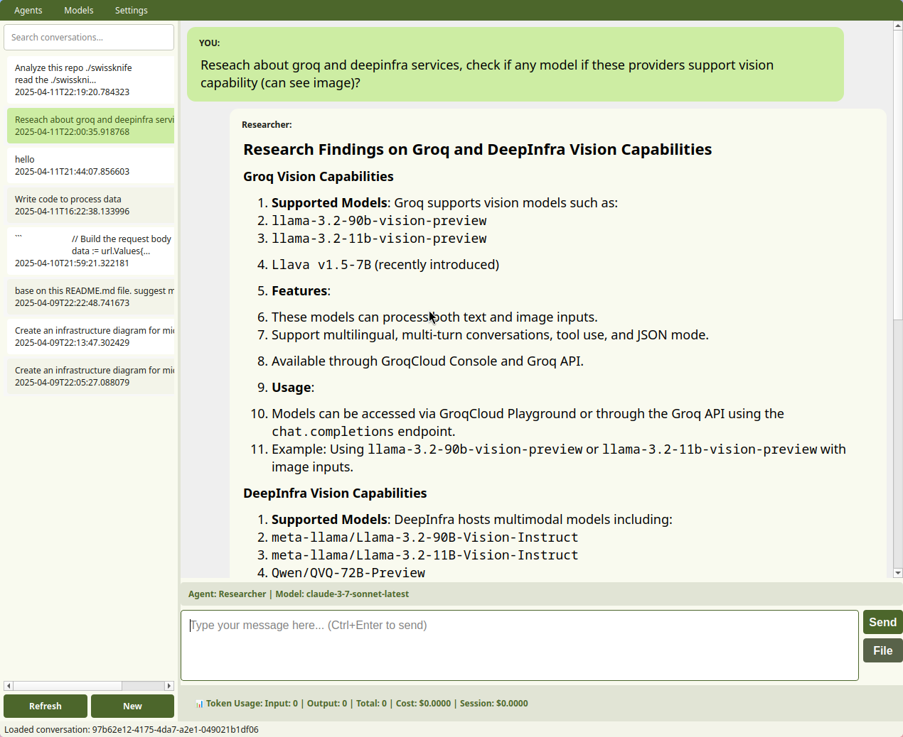
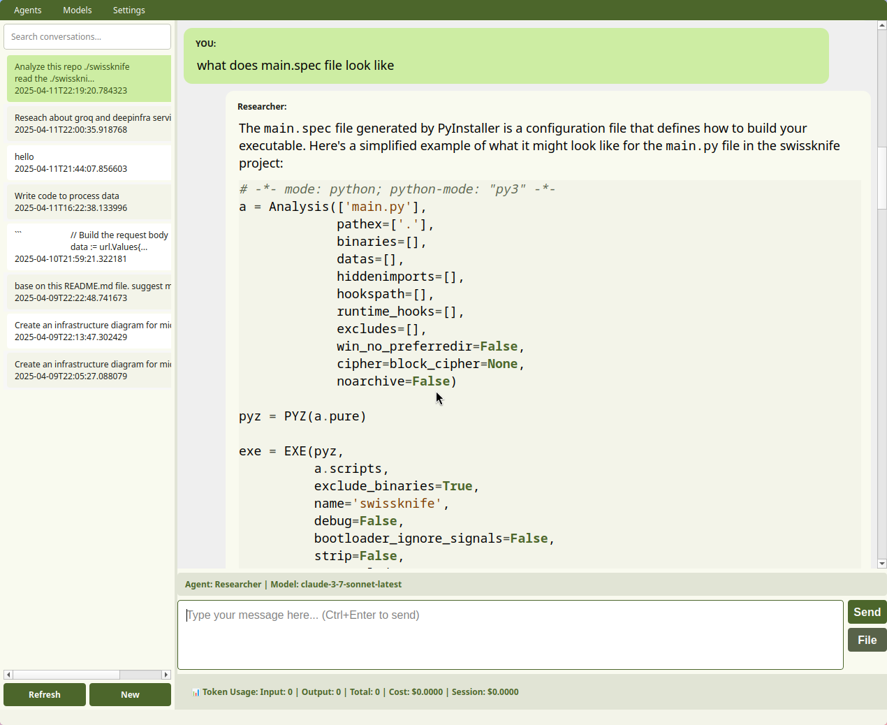
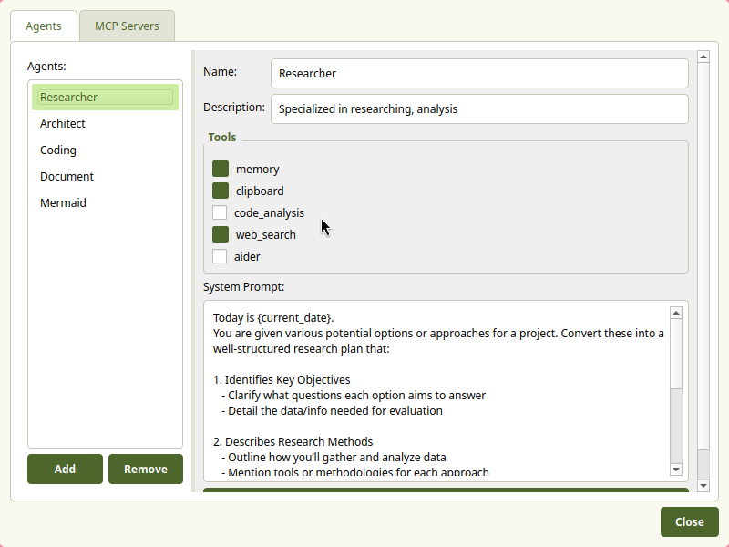
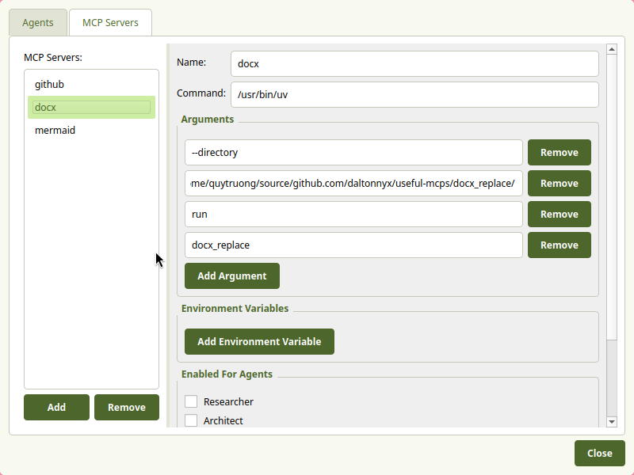
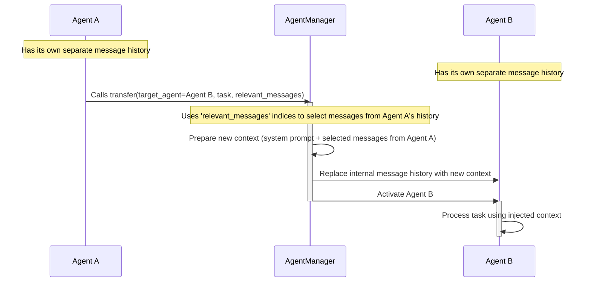

# AI Multi-Agent Interactive System

A sophisticated chat application that provides an enhanced interactive AI
experience through a multi-agent architecture and support for multiple LLM
providers. It features specialized agents, intelligent transfers, file
integration, web capabilities, and a modular extension system.

## Screenshots







## Installation

### Prerequisites

- Python 3.10 or higher.
- [uv](https://github.com/astral-sh/uv) for package manager.
- An Anthropic API key (for Claude AI models).
- A Groq API key (optional, for Groq LLM models).
- An OpenAI API key (optional, for GPT models).
- A Google Gemini API key (optional, for Gemini models).
- A Tavily API key (for web search features).

### Setup

1. Clone this repository:

   ```bash
   git clone https://github.com/daltonnyx/swissknife.git
   cd swissknife
   ```

2. Install the package:

   ```bash
   uv sync
   ```

3. Install the tool

   ```bash
   uv tool install .
   ```

4. Make sure you have one of `ANTHROPIC_API_KEY`, `OPENAI_API_KEY`,
   `GOOGLE_API_KEY`, `GROQ_API_KEY`, `DEEPINFRA_API_KEY` in Environment
   variables. you can setup multi LLM api key for switching model in app

   ```
   ANTHROPIC_API_KEY=your_anthropic_api_key
   OPENAI_API_KEY=your_openai_api_key
   GROQ_API_KEY=your_groq_api_key
   GOOGLE_API_KEY=your_google_api_key
   TAVILY_API_KEY=your_tavily_api_key
   ```

   `TAVILY_API_KEY` is for web search capability. omit it if you don't need that
   features

## Usage

### Start an Interactive Chat

```bash
swissknife chat
```

### Start an Interactive Chat with TUI

```bash
swissknife chat --console
```

### Start a Chat with Different Providers

```bash
# Use Claude models from Anthropic
swissknife chat --provider claude

# Use LLM models from Groq
swissknife chat --provider groq

# Use GPT models from OpenAI
swissknife chat --provider openai

# Use Gemini models from Google
swissknife chat --provider gemini

# Use LLM models from Deepinfra
swissknife chat --provider deepinfra
```

### Start chat with different agent config

```bash
swissknife chat --agent-config path/to/custom_agents.toml
```

### Start Google A2A server for remote connection

```bash
uv run swissknife/main.py a2a-server --provider google --agent-config ~/.swissknife/agents.toml --port 41241
```

## Security & Responsibility Notice

Swissknife gives you powerful control over AI agents and external tools.

- You are responsible for the content of agent system prompts.
- You are responsible for which external tools (MCP, file, clipboard) you
  enable.
- Unsafe prompts or tools may result in data leaks, loss, or unwanted actions.
- Always review prompts and tool settings before use.
- Use safe defaults unless you understand the risks of advanced configurations.
  For maximum safety:
  - Limit tool permissions to only what is needed.
  - Never include passwords or sensitive data in prompts or config files.
  - Confirm before enabling tools with file system or network access.

## Core Architecture

### Multi-Agent System

This system implements a multi-agent architecture with specialized agents with
`toml` config file `agents.toml`:

```toml
[[agents]]
name = "Coding"
description = "Specialized in code implementation, debugging, programming assistance and aider prompt"
tools = ["clipboard", "memory", "code_analysis", "spec_validator"]
system_prompt = """You are Harvey, a focused code implementation expert. Your guiding principle: **SIMPLICITY IN IMPLEMENTATION** (Simple + Practical Implementation). Prioritize clean, maintainable code that aligns with best practices.

Today is {current_date}.
"""
```

Current supported dynamic template tag is:

- `current_date`: return current date in YYYY-MM-dd format

The system intelligently routes tasks to the appropriate agent and features
seamless **agent transfer** when a conversation requires different expertise.
This allows for:

- Domain-specialized reasoning and responses.
- Continuity of context during complex multi-domain tasks.
- Improved problem-solving through agent collaboration.

```
[User Input] --> [Agent Manager] --> [Selected Agent] --> [LLM Service] --> [Response]
```

### Agent Transfer Mechanism

The intelligent transfer system allows seamless transitions between specialized
agents:

1. The current agent identifies when a different expertise is required.
2. A transfer request is initiated with sharing context Mechanism.
3. The appropriate specialized agent is activated.
4. Conversation continues with maintained context but specialized capabilities.



## Key Features

- **Interactive Chat**: Rich conversation interface with various AI models.
- **File Integration**: Include PDFs and text files directly in conversations.
- **Web Capabilities**: Fetch content, perform searches, and extract information
  from the web.
- **Tool Ecosystem**: Extensible set of tools via MCP support.
- **Keyboard Shortcuts**: Efficient message editing and response management.
- **Persistent Memory**: Cross-conversation knowledge retention and retrieval.
- **Code Analysis**: Deep analysis of code structure in repositories.

## Agent System Details

### Agent Manager

The system employs a centralized Agent Manager that:

- Maintains the registry of available specialized agents.
- Handles selection of the appropriate agent for each task.
- Manages the transfer process between agents.
- Ensures context sharing during transitions.

### Agent Activation

Each agent features:

- A specialized system prompt optimized for its domain.
- Specific tools relevant to its expertise.
- Custom reasoning patterns suited to its specialty.

## LLM Provider Integration

The system implements a unified service layer that:

- Standardizes interactions across different LLM providers.
- Transforms messages between provider-specific formats.
- Handles provider-specific authentication and API interactions.
- Manages tool registration and execution for each provider.

### Provider-Specific Features

- **Claude (Anthropic)**: Extended thinking mode for complex reasoning.
- **GPT (OpenAI)**: Advanced tool use and function calling.
- **Groq**: High-performance inference for faster responses.
- **Deep infra**: more options for open-source models.
- **Gemini (Google)**: Multimodal processing and advanced content generation.

## Additional Capabilities

- **Web Content Processing**: Fetch and process web content as markdown.
- **Web Search**: Search the internet for current information.
- **Web Content Extraction**: Extract and analyze content from specific URLs.
- **Model Context Protocol (MCP)**: Connect to MCP-compatible servers to extend
  AI capabilities.
- **Memory System**: Store, retrieve, and manage conversation history.
- **Code Structure Analysis**: Generate structural maps of source code.

## Chat Features

- **File Integration**: Include files in your conversation.
- **Web Integration**: Ask the AI to scrape URLs or search the web directly.
- **Copy Responses**: Easily copy AI responses to your clipboard with Alt+C.
- **Multiline Input**: Write complex messages with proper formatting.
- **Code Analysis**: Analyze and understand the structure of code repositories.

## Extended Thinking Mode

The system supports extended thinking capability (currently only with Claude),
which allows the AI to:

- Work through complex problems step-by-step.
- Show its reasoning process before providing a final answer.
- Allocate a specific token budget for the thinking process.

Enable thinking mode during chat with `/think <budget>` command, where budget is
the token allocation (minimum 1024 tokens). Support reasoning effort of openai,
`budget` can be `low`, `medium` or `high` when using openai reasoning model

## Chat Commands

During an interactive chat session, you can use these commands:

- `/file <file_path>` - Include a file in your message.
- `/clear` - Clear the conversation history.
- `/think <budget>` - Enable extended thinking mode with specified token budget
  (min 1024). for openai reasoning model, `<budget>` can be `low`, `medium`,
  `high`
- `/think 0` - Disable thinking mode.
- `/model <model_id>` - Switch to a different AI model during your chat session.
- `/models` - List all available models you can switch to.
- `/agent <agent_name>` - Switch to a different specialized agent.
- `/agents` - List all available specialized agents.
- `exit` or `quit` - End the chat session.
- Press `Enter` for a new line, `Ctrl/Cmd+Enter` to submit your message.

## Memory System

The tool includes a persistent memory system that:

- Automatically stores all conversations.
- Allows the AI to retrieve relevant past conversations using the
  `retrieve_memory` tool.
- Automatically cleans up conversations older than one month.
- Intelligently chunks and stores conversations for efficient retrieval.

## Universal MCP Server Support

The system supports connecting to any MCP-compatible server using the following
configuration format in your `mcp_servers.json` file:

```json
{
    "server_id": {
        "name": "string",
        "command": "string",
        "args": ["string"],
        "env": {
            "key": "value"
        },
        "enabledForAgents": ["string"]
}
```

- `server_id`: Unique identifier for the server.
- `name`: Human-readable name for the server.
- `command`: The command to execute to start the server.
- `args`: List of arguments to pass to the command.
- `env`: Environment variables to set for the server process.
- `enabledForAgents`: List of agent names that are allowed to use tools from
  this server.

## Roadmap

The following features are planned for future releases:

### Enhanced Assistant Capabilities

- [x] **Web Search Integration**: Allow AI to search the web for real-time
      information.
- [x] **Conversation Memory**: Store and retrieve past conversations.
- [x] **Code Analysis**: Analyze code structure in git repositories.
- [x] **Model Context Protocol (MCP) Support**: Implement MCP for improved
      context management.
- [x] **Command-line Thinking Mode Options**: Enable and configure thinking mode
      with the `/think` command.
- [x] **Agents through config**: Dynamic agents configurations through config
      file
- [ ] **Google A2A Compatible**: Support Google A2A protocol for both client and
      server

### Advanced Personalization

- [ ] **Enhanced Memory Management**: Configure memory retention periods and
      retrieval preferences.
- [ ] **Local Model Support**: Add ONNX runtime integration.
- [ ] **Advanced Memory Indexing**: Improve memory retrieval accuracy and
      performance.
- ~~[x] **Adaptive User Context**: Agent can build up a context and knowledge
  base when interact with user and use it to tailor the response~~ => due to
  messing around with current request, will comeback on this later
- [x] **Multi-Agent Collaboration**: Enable multiple agents to work together on
      complex tasks.

### User Experience

- [x] **Session Management**: Save, resume, and manage multiple conversation
      threads.
- [x] **UI Improvements**: Enhanced terminal interface with better visualization
      options.
- [ ] **Configuration Profiles**: Create and switch between different tool
      configurations.
- [ ] **Memory Visualization**: Browse and manage stored conversations.
- [ ] **Agent Performance Metrics**: Track and analyze agent effectiveness.

## License

[MIT License](LICENSE)
